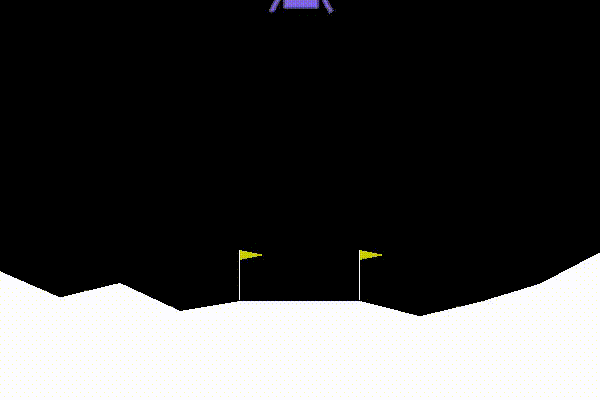

*PPO agent trained to
play*\  `LunarLanderContinuous-v2 <https://gym.openai.com/envs/LunarLanderContinuous-v2/>`__\ *.
Reward per episode at this point was ~230.*

Welcome to flare's documentation!
---------------------------------

Flare was written to be a modular reinforcement learning library.

Find the full contents of the :ref:`flare-package-contents`.

.. _flare: ./source/flare

``flare`` is a small reinforcement learning library. Currently, the use
case for this library is small-scale RL experimentation/research. Much
of the code is refactored from and built off of
`SpinningUp <https://spinningup.openai.com/en/latest/>`__, so massive
thanks to them for writing quality, understandable, and performant code.

(old) Blog post about this repository
`here <https://jfpettit.svbtle.com/rlpack>`__.

.. toctree::
   :caption: Flare documentation
   :maxdepth: 2
   
   installation
   usage
   source/flare
   CONTRIBUTING

References
~~~~~~~~~~

-  `OpenAI SpinningUp <https://spinningup.openai.com/en/latest/>`__
-  `FiredUp <https://github.com/kashif/firedup>`__
-  `PPO paper <https://arxiv.org/abs/1707.06347>`__
-  `A3C paper <https://arxiv.org/abs/1602.01783>`__
-  `Pytorch RL
   examples <https://github.com/pytorch/examples/tree/master/reinforcement_learning>`__

